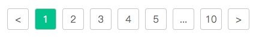

# vue-pagination
简单分页器，为了保持核心逻辑清晰，因此没有为了通用性而增加额外接口，若需要定制化使用，请folk或copy源码。



## 安装
### npm
```
$ npm i @vv13/vue-pagination
```

### Props
#### total
- 类型：Number
- 默认值：0
- 说明: 总条数

#### pageSize
- 类型：Number
- 默认值：10
- 说明：每页条数

#### page
- 类型：Number
- 默认值：1
- 说明：当前页
- 其他：为了保证页码正确，请使用sync修饰符，否则可不用传此参数

### Events
#### pageChange(index)
- 参数
  - index，Number，改变后的页码
- 说明： 
  - 页码改变后触发的事件
